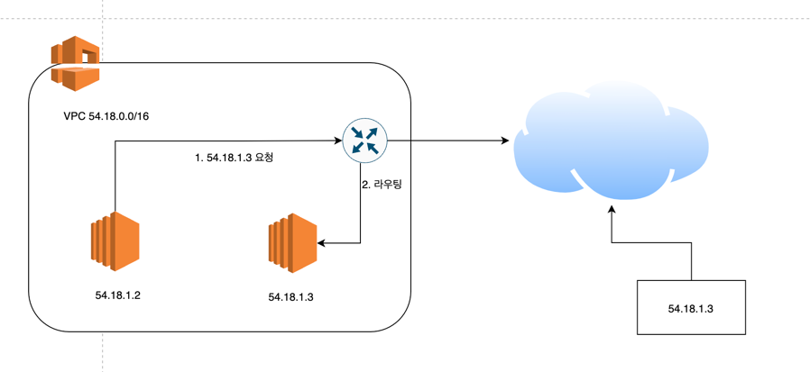
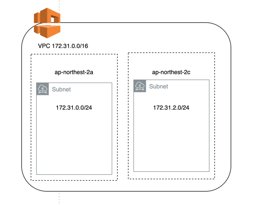
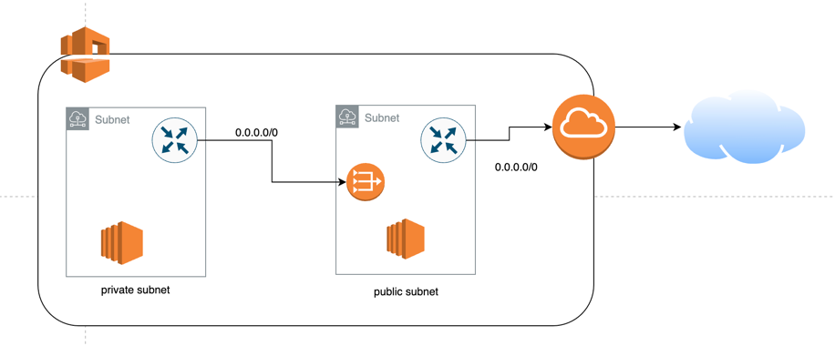

# VPC

## VPC for connecting with Internet
### IP 주소 선택
vpc 에서 사용할 private ip 주소는 기본적으로 CIDR 을 이용하여 IP 를 나타냅니다.

CIDR 에서 "172.31.0.0/16" 의 의미는 앞의 16비트는 고정, 뒤의 16비트는 변경가능함을 의미합니다.

즉, 2^16 = 65536 개의 IP 를 사용할 수 있는 네트워크를 정의할 때 위 처럼 사용할 수 있습니다. 

Private ip address 는 RFC 1918 에 명시되어 있는 주소 범위를 이용해야합니다.


만약 위 처럼 vpc 내의 ip address range 를 생성하게 되면 인터넷과 연결된 54.18.1.3 으로 가야할 요청이 vpc 내부의 다른 54.18.1.3 의 ip 를 가진 서버로 갈 수도 있습니다.

RFC 1918 에 명시되어 있는 주소 범위는 다음과 같습니다.
```
10.0.0.0 ~ 10.255.255.255 (10.0.0.0/8)
172.16.0.0 ~ 172.31.255.255 (172.16.0.0/12)
192.168.0.0 ~ 192.168.255.255 (192.168.0.0/16)
```

### AZ 별 서브넷 설정
vpc 내에 여러 서브넷이 존재할 수 있는데, 서브넷은 하나의 AZ 에 속해야합니다.



만약 /16 의 ip address range 를 가진 vpc 를 생성하였다면, 각 AZ 별로 익숙한 /24 의 ip address range 를 가진 서브넷 생성을 권고합니다.


### Route table 설정
만든 vpc 가 인터넷과 연결될 수 있는 경로를 만들기 위해 route table 을 설정해야합니다.

기본적으로 vpc 를 생성하면 Default route table 이 존재하고, 모든 서브넷의 설정이 하나의 route table 에 혹은 각 서브넷에 route table 을 할당할 수도 있습니다.

아래는 Default route table 의 설정입니다.

```
# vpc ip address range 타겟의 요청을 vpc 내부(local)로 연결하는 설정입니다.
# 따라서 기본적으로 vpc 내의 인스턴스끼리는 통신 가능합니다.
Destination     Target
172.31.0.0/16   local
```

인터넷과 연결하기 위해서는 아래와 같이 설정할 수 있습니다.

```
# 0.0.0.0/0 는 모든 네트워크를 의미합니다.
# 172.31.0.0/16 이외의 모든 요청은 인터넷으로 향하게 됩니다. 
Destination     Target
172.31.0.0/16   local
0.0.0.0/0       internet-gateway-id
```


### vpc 네트워크 보안 설정
vpc 네트워크 보안은 Network ACLs 와 Security Groups 를 이용하여 설정할 수 있습니다.

Network ACLs 는 서브넷 단위로 할당되는 방화벽 규칙으로, 서브넷 내의 모든 리소스가 해당 규칙을 적용받게 됩니다.

Security Groups 는 사용자가 설정한 규칙을 각 리소스에 할당하는 방식의 방화벽 규칙입니다.
security group 은 다른 security group 을 참조하여 설정할 수 있으므로 server-sg 는 특정 IP 대역이 아닌 client-sg 가 적용된 리소스만 허용하도록 설정할 수도 있습니다.  
 

### VPC 트래픽 설정

## private vpc 의 인터넷 연결
일반적으로 유저와 직접 연결되는 클라이언트 단의 어플리케이션은 public subnet 에, 서버나 db 등은 private subnet 에 위치시킬 수 있습니다.

그런데 인터넷과 연결되지 않은 private subnet 도 package install, patch 등의 여러 이유로 인터넷과의 연결이 필요할 수도 있습니다.

이때, public subnet 에 NAT 을 생성하고, private subnet 의 route table 에 0.0.0.0/0 경로의 요청이 NAT gateway 을 타게 설정하면 private subnet 의 리소스들이 인터넷과 연결될 수 있습니다.
(NAT gateway 는 public ip 를 갖습니다.)



```
# private subnet 의 route table 에 nat gateway 를 타도록 설정합니다.
Destination     Target
172.31.0.0/16   local
0.0.0.0/0       nat-gateway-id
```

당연하게도 private subnet 내의 리소스들은 public ip address 가 없기때문에 외부에서는 접근하지 못합니다.

## VPC peering
VPC peering 은 두개의 vpc 를 연결하는 방법입니다.

같은 어카운트 내의 VPC 뿐 아니라 다른 어카운트의 VPC 를 연결할 수도 있습니다.