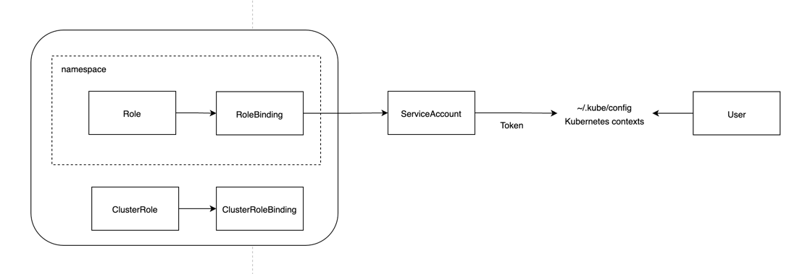

# RBAC
쿠버네티스는 인증/인가를 역할 기반 접근 제어(Role Based Access Controller)로 구현합니다.

쿠버네티스는 리눅스의 일반 사용자처럼 특정한 권한을 제한하는 사용자 계정을 생성하여 특정 네임스페이스에만 실행을 제한하거나 create/get 등의 명령에 대한 권한을 상세히 지정할 수도 있습니다.

## Role/RoleBinding, RoleBinding/ClusterRoleBinding
파드와 네임스페이스 생성/조회 등 쿠버네티스 환경의 사용자 권한 관련 설정은 역할(Role, ClusterRole)로 지정합니다.

Role 은 서비스, 파드 등 특정 네임스페이스에 속하는 리소스, ClusterRole 은 PV, 전체 네이스페이스에 대한 조회 등 네임스페이스에 속하지 않는 것에 대한 권한을 지정합니다.

Role 이 권한이 지정된 리소스라면 있으면 해당 권한을 사용자에게 할당하는 것은 RoleBinding 을 이용합니다.  

## ServiceAccount, User, KubeConfig
Service account 는 사용자가 쿠버네티스 API 서버를 이용하기 위한 인증 과정을 처리하는 역할을 합니다.

Service account 를 생성하면 해당 Service account 의 토큰이 생기고, 쿠버네티스는 이 토큰 정보를 kubeconfig 설정파일의 사용자 토큰 정보에 등록해서 사용자와 서비스 어카운트를 연결합니다.



k8s 1.24 이전에는 토큰을 자동으로 생성해줬었는데 이제는 secret 을 통해 토큰을 관리해야합니다.

```
bash init-pok8s-rbac.sh
```