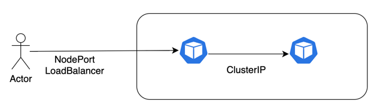
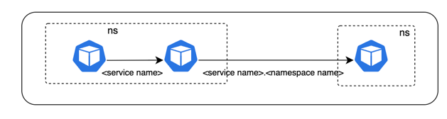
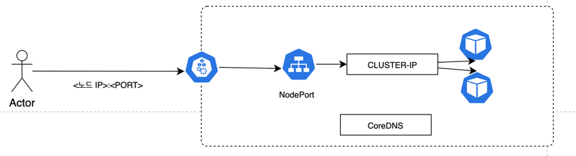
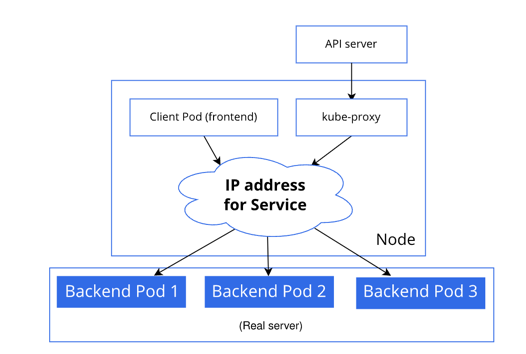

# Service

서비스 리소스는 쿠버네티스 리소스의 한 종류로 파드 간 네트워크 연결을 담당합니다.

일반적으로 파드는 문제가 발생하면 곧바로 종료(terminate)하고 새로운 파드를 만드는 방식으로 장애 대응 시간을 줄여주는데,
이렇게 파드를 종료하고 새로운 파드를 만들게 되면 파드의 IP 주소가 변경되고 다른 파드에서 이 파드를 찾을 수 없게 됩니다.

쿠버네티스 서비스는 서비스 디스커버리를 통해 동적으로 파드가 종료되고 생성되는 환경에서 파드 간 연결을 자동으로 가능하게 해줍니다.

서비스는 클러스터 내/외부 연결에 따라 타입이 아래와 같이 구분됩니다.
- 클러스터 내부에서 파드와 파드의 연결: ClusterIP, Headless
- 클러스터 외부에서 클러스터 내부의 파드를 연결: NodePort, LoadBalancer, ExternalName



NodePort 는 ClusterIP 방식을 내부에 포함하고, LoadBalancer 는 NodePort 방식을 내부에 포함하고 있어, 서비스 타입은 다르지만 내부 구현은 서로 연관되어 있다고 볼 수 있습니다.

## ClusterIP
서비스는 필요한 파드를 선택하기 위해 셀렉터(Selector) 옵션을 이용하고, 셀렉터는 내부적으로 레이블(label)을 기준으로 리소스를 선택합니다.

```
# service
spec:
  type: ClusterIP
  selector:
    app: {{ .Values.name }}
```

아래 명령을 실행하면 redis 용 clusterIP 와 파드가 생성되고, 셀렉터를 이용해 서비스가 생성되면 자동으로 엔드포인트가 만들어집니다.
이 엔드포인트는 서비스에서 관리하는 도착종료 지점으로 클라이언트가 서비스 이름 또는 ClusterIP 로 호출할 때 도착하는 실제 파드의 IP 주소가 됩니다.

```
bash init-helm-redis.sh
```

아래 명령으로 나온 endpoint 와 실제 파드의 ip 를 비교하여 같은 경우에는 서비스가 정상적으로 파드를 선택했다는 것입니다.

```
k get endpoints -n helm
```

이제 busybox 파드를 생성하고, 해당 파드에서 서비스 이름을 이용하여 호출하면 정상접근이 되는 것을 확인할 수 있습니다.

**서비스 이름을 호출하면 쿠버네티스 DNS 가 서비스를 생성할 때 등록한 CLUSTER-IP 주소를 응답하고 클라이언트는 해당 CLUSTER-IP 로 요청을 전달합니다.**

**CLUSTER-IP 는 실제 파드와 연결을 담당하는 Virtual IP 로, 클라이언트가 CLUSTER-IP 로 접속하면 이 가상 IP 주소가 실제 파드의 실제 IP 주소로 리다이렉트합니다.** 

```
# busybox 파드 생성
bash init-pok8s-busybox.sh

# 파드 접근
k exec -it <pod name> -n pok8s sh

# clusterIP 이름으로 접근 가능
ping helm-redis-ip -c 1
```

nslookup 으로 얻은 IP 주소와 service 의 CLUSTER-IP 가 동일한 것도 확인가능합니다.

```
# busybox 파드에서 호출
nslookup helm-redis-ip

# service 의 CLUSTER-IP 확인
k get svc -n helm
```

다시 말하자면, 서비스 이름을 도메인 이름으로 질의하면 가상 IP (CLUSTER-IP) 를 응답하고, 이 가상 IP 가 실제 파드의 IP 로 리다이렉트합니다.

**다만 같은 namespace 내에 있어야 서비스 이름으로 접근할 수 있고, 다른 namespace 면 pod 의 ip 로 접근할 수 있습니다. 이유는 아래에서 설명합니다.**


## 서비스 디스커버리
**만약 기존 파드가 삭제되고 새로운 파드가 떠도 서비스 네임으로 정상 접근 가능합니다. 이 떄, 도메인 응답 결과인 CLUSTER-IP 는 변환가 없고 해당 IP 주소가 가상 IP 주소로 동작해서 새로 생성된 파드의 IP 주소로 리다이렉트합니다.**

```
bash init-helm-redis.sh

# 파드 접근
k exec -it <pod name> -n helm sh

# clusterIP 이름으로 접근 가능
ping helm-redis-ip -c 1
```

**엔드포인트는 쿠버네티스 API 서버의 etcd 데이터베이스의 변경 내역을 실시간으로 반영하여 새로운 값으로 갱신하는데, 이 덕분에 변경된 실제 IP 주소는 엔드포인트로도 조회됩니다.**

만약 파드의 수량이 변경되면 2개의 파드를 찾고 로드밸런싱되고, 엔드포인트에는 파드 IP 가 하나 더 추가된 것을 확인할 수 있습니다.

```
k get endpoints -n helm  # 10.1.1.75:3000,10.1.1.76:3000,10.1.1.77:3000
```

## 쿠버네티스 DNS 기능 이해

쿠버네티스의 DNS 는 CoreDNS, LocalDNS 로 나누어 사용하고 모두 마스터 노드의 파드로 관리됩니다.

LocalDNS 는 coreDNS 의 캐시로, DNS 응답 속도를 향상시키고 CoreDNS 부하를 줄일 수 있도록 1.18 버전부터 정식으로 도입되었습니다.  


```
# coreDNS 파드 확인
k get pod -o wide -n kube-system
```

실제 DNS 질의를 하는 IP 주소와 search 옵션은 아래에서 확인할 수 있습니다.

```
# localDNS 혹은 coreDNS 서비스 오브젝트의 IP 주소 확인
k exec -it <pod name> -n helm sh
cat /etc/resolv.conf

# 결과
nameserver 10.96.0.10
search helm.svc.cluster.local svc.cluster.local cluster.local
options ndots:5
```

### DNS 의 Search 옵션
/etc/resolv.conf 에서 search 옵션을 확인할 수 있는데, 이 옵션은 도메인 이름을 질의할 때, 도메인 이름에 search 옵션에 있는 도메인을 붙여서 질의하는 옵션입니다.

즉, 클라이언트가 DNS 서버로부터 결과가 없다는 응답을 받으면 이 부분 도메인 목록을 차례대로 붙여가며 추가로 DNS 서버를 호출합니다.

**이 옵션은 네임스페이스에 따라 기본 설정이 달라지는데, 이 덕분에 같은 네임스페이스 내에서는 단순히 서비스 이름만으로도 네트워킹을 할 수 있고, 서로 다른 네임스페이스를 연결하기 위해서는 네임스페이스 이름까지 포함해야 합니다.**


실제 다른 네임스페이스의 서비스네임을 nslookup 을 이용하여 조회하면 상세 도메인 네임이 네임스페이스에 의해 다른게 표현되는 것을 확인할 수 있습니다.

```
nslookup helm-redis-ip

# helm 네임스페이스에서의 조회결과
helm-redis-ip.helm.svc.cluster.local

# pok8s 네임스페이스에서의 조회결과
helm-redis-ip.pok8s.svc.cluster.local
```

따라서 pok8s 네임스페이스에서 helm 네임스페이스의 helm-redis-ip 를 조회하려면 아래처럼 해야합니다.
```
ping helm-redis-ip.helm -c 1
```

## NodePort
클러스터 외부에서 내부의 파드로 연결할 수 있도록 해주는 서비스 타입입니다. 

**ClusterIp 는 내부 파드 간 연결은 CLUSTER-IP 를 가상 IP 주소로 사용하여 실제 파드의 실제 IP 주소로 리다이렉트하는 방식을 이용하였습니다. 
NodePort 는 클러스터 외부에서 클러스터 노드의 네트워크 카드 인터페이스의 포트를 통해 내부의 파드와 연결합니다. 다만, nodePort 도 파드와 연결할 때는 clusterIP 와 마찬가지로 CLUSTER-IP 가 할당되고, 이를 통해 실제 파드의 실제 IP 주소로 연결됩니다.**



### 서비스에서의 LoadBalancing
쿠버네티스의 모든 서비스는 기본적으로 로드밸런싱을 지원합니다.

**쿠버네티스의 모든 노드에서 실행 중인 kube-proxy 파드는 서비스와 연동해서 노드 내에서 실행중인 모든 파드의 ingress/egress 네트워크 트래픽을 처리합니다.**

**kube-proxy 는 기본 설정으로 IPVS(IP Virtual server) 모드로 동작하고, 관련 설정은 kube-proxy 설정 파일인 configmap 에서 확인할 수 있습니다.**

**IPVS 는 ClusterIp 서비스와 연동하여 CLUSTER-IP 로 요청하는 연결을 내부 파드로 전달하는 역할을 합니다.**

> 초기에는 userspace, 2019년 12월에는 iptables 에서 ipvs 로 넘어왔습니다.



```
# kube-proxy configmap 확인
k describe cm -n kube-system kube-proxy
```

노드 내 kube-proxy IPVS 모드에서 내부적으로 처리하는 IP 라우팅 규칙은 ipvsadm 명령으로 확인할 수 있고, ClusterIp, NodePort 모두 round-robin 방식으로 로드밸런싱을 수행하도록 라우팅 설정이 적용된 것을 확인할 수 있습니다.

즉, 어떤 요청은 반드시 kube-proxy 를 거치게 되는데, 여기에 있는 라우팅 설정으로 인해 로드밸런싱이 이루어져 여러 파드에 골고루 요청을 전달하게 됩니다.

이렇게 사용할 수도 있지만 NodePort 는 30000~32767 포트 중 하나를 선택해야하므로 well-known 포트를 사용하는 것이 불가능하고, 특정 도메인이 아닌 특정 노드의 IP 를 지정하야하는 방식에서 안정성 등에 문제가 생길 수 있습니다.


## LoadBalancer
위의 NodePort 의 문제를 해결하기 위해 제공하는 서비스입니다.